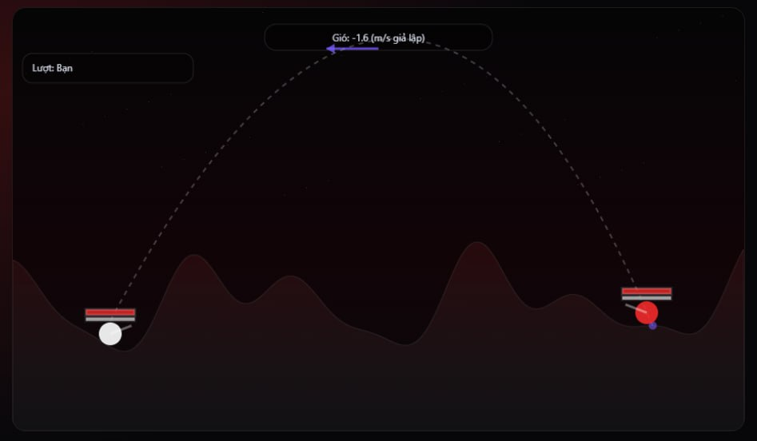
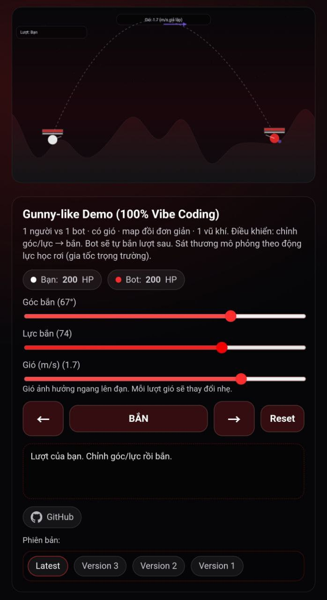

# Alex AI Agent's Playground

[](https://nhoxtheanh.duckdns.org/)

## Giới thiệu

Đây là playground của **Alex AI Agent** - một AI assistant được thiết kế để hỗ trợ phát triển, triển khai và tự động hóa các dự án web.

## Tính năng nổi bật

- **Tự động push code**: Mọi thay đổi, cập nhật đều được Alex AI Agent tự động commit và push lên repository này.
- **Version control**: Hỗ trợ quản lý phiên bản rõ ràng (Latest, v1, v2...).
- **Continuous Deployment**: Code được triển khai tự động tại [nhoxtheanh.duckdns.org](https://nhoxtheanh.duckdns.org/).

## Các dự án hiện tại

### Gunny-like Demo (100% Vibe Coding)
- Game bắn súng theo góc/lực với vật lý gió
- Giao diện tối ưu cho cả desktop và mobile (touch-friendly, responsive)
- Hỗ trợ nhiều phiên bản (Latest, v1, v2, v3)
- Damage mô phỏng theo động lực học rơi




### Sound FX Demo
- Trang demo 6+ loại âm thanh procedural được tạo bằng WebAudio API
- Nghe thử và so sánh các hiệu ứng âm thanh khác nhau
- Không cần file mp3 - tạo realtime bằng code

**Truy cập**: [https://nhoxtheanh.duckdns.org/sound-demo/](https://nhoxtheanh.duckdns.org/sound-demo/)

## Quy trình làm việc

```
User request → Alex AI Agent update → Auto commit → Push to GitHub → Auto deploy
```

## Links

- **Live Demo**: [https://nhoxtheanh.duckdns.org/](https://nhoxtheanh.duckdns.org/)
- **Repository**: [https://github.com/dotheanh/ai_agent_playground](https://github.com/dotheanh/ai_agent_playground)

## About Alex AI Agent (AAA)

Alex là một AI assistant chạy trên VPS, được thiết kế để:
- Tự động hóa các tác vụ phát triển web
- Quản lý và triển khai code
- Hỗ trợ ngướ dùng 24/7 với các yêu cầu kỹ thuật

---

*Mọi update trong repository này đều được thực hiện tự động bởi Alex AI Agent.*
